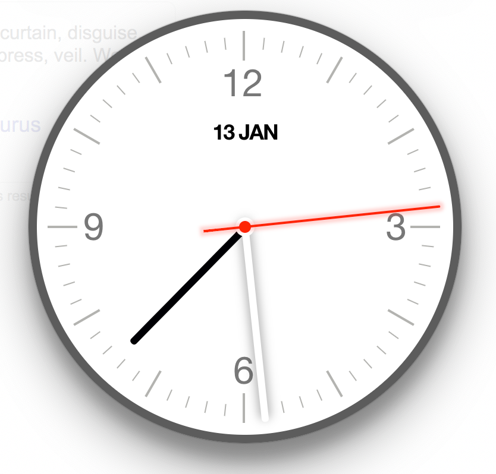

This project was bootstrapped with [Create React App](https://github.com/facebook/create-react-app) & [Electron Builder](https://github.com/electron-userland/electron-builder)

Shows a watch with the current time. I find it useful given that in Mac I have the menu bar hidden all time - I prefer to use the keyboard over the mouse - so when I want to see the time I prefer to switch to an app (using Alfred) than reaching the mouse to reveal the menu bar.

## Setup

```
$ yarn install
$ yarn start // runs the app so that Electron can reach it for development
$ yarn electron-dev
```

## Distribution

```
$ yarn dist
$ open dist/mac/
```

Enjoy!
